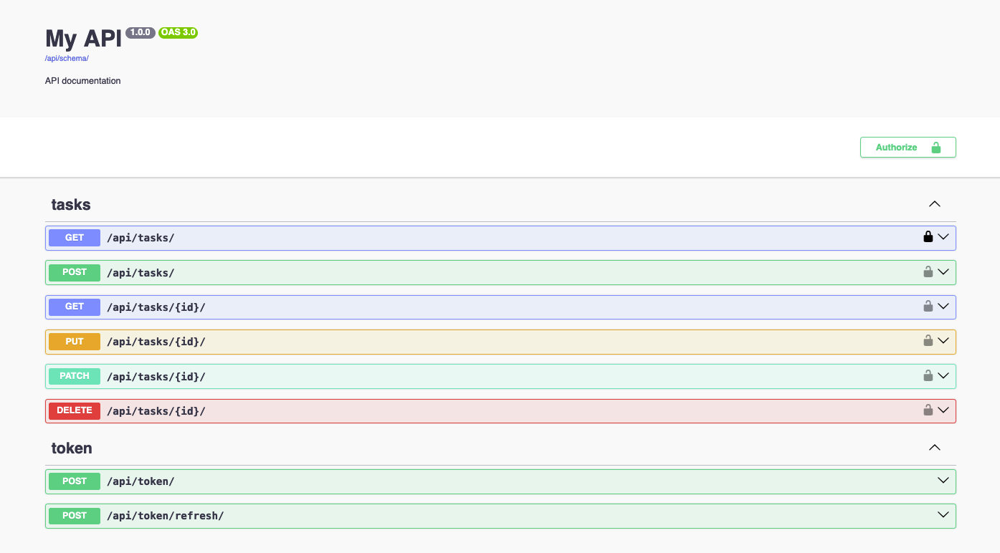

# Django REST API con JWT y OpenAPI (Swagger)

API productiva con Django 6 y DRF, autenticación robusta con JWT.
Documentación interactiva y auto-generada con Swagger/OpenAPI.
CRUD de tareas listo para integrarse con frontends modernos vía CORS.



## 1. Crear entorno virtual y activarlo
```bash
python -m venv venv
source venv/bin/activate  # Linux/Mac
venv\Scripts\activate     # Windows
```

## 2. Instalar dependencias
```bash
pip install django djangorestframework
pip install django-cors-headers
pip install drf-spectacular
```

## 3. Crear proyecto Django
```bash
django-admin startproject myproject .
```

## 4. Crear app
```bash
python manage.py startapp myapp
```

## 5. Configurar settings.py
```python
INSTALLED_APPS = [
    'django.contrib.admin',
    'django.contrib.auth',
    'django.contrib.contenttypes',
    'django.contrib.sessions',
    'django.contrib.messages',
    'django.contrib.staticfiles',
    'rest_framework',  # Agregar
    'myapp',           # Agregar
]
```

## 6. Crear modelo (myapp/models.py)
```python
from django.db import models

class Task(models.Model):
    title = models.CharField(max_length=200)
    description = models.TextField()
    completed = models.BooleanField(default=False)
    created_at = models.DateTimeField(auto_now_add=True)

    def __str__(self):
        return self.title
```

## 7. Crear migraciones y migrar
```bash
python manage.py makemigrations
python manage.py migrate
```

## 8. Crear serializer (myapp/serializers.py)
```python
from rest_framework import serializers
from .models import Task

class TaskSerializer(serializers.ModelSerializer):
    class Meta:
        model = Task
        fields = '__all__'
```

## 9. Crear views (myapp/views.py)
```python
from rest_framework import viewsets
from .models import Task
from .serializers import TaskSerializer

class TaskViewSet(viewsets.ModelViewSet):
    queryset = Task.objects.all()
    serializer_class = TaskSerializer
```

## 10. Configurar URLs del proyecto (myproject/urls.py)
```python
from django.contrib import admin
from django.urls import path, include

urlpatterns = [
    path('admin/', admin.site.urls),
    path('api/', include('myapp.urls')),
]
```

## 11. Crear URLs de la app (myapp/urls.py)
```python
from django.urls import path, include
from rest_framework.routers import DefaultRouter
from .views import TaskViewSet

router = DefaultRouter()
router.register(r'tasks', TaskViewSet)

urlpatterns = [
    path('', include(router.urls)),
]
```

## 12. Registrar modelo en admin (myapp/admin.py)
```python
from django.contrib import admin
from .models import Task

admin.site.register(Task)
```

## 13. Crear superusuario
```bash
python manage.py createsuperuser
```

## 14. Ejecutar servidor
```bash
python manage.py runserver
```

## 15. Probar la API
- **Lista/Crear**: `http://127.0.0.1:8000/api/tasks/`
- **Ver/Editar/Eliminar**: `http://127.0.0.1:8000/api/tasks/1/`
- **Admin**: `http://127.0.0.1:8000/admin/`

## 16. Crear requirements.txt
```bash
pip freeze > requirements.txt
```

Documentación extra:
- `https://pypi.org/project/django-cors-headers/`
- `https://pypi.org/project/drf-spectacular/`
- `https://django-rest-framework-simplejwt.readthedocs.io/en/latest/getting_started.html`
